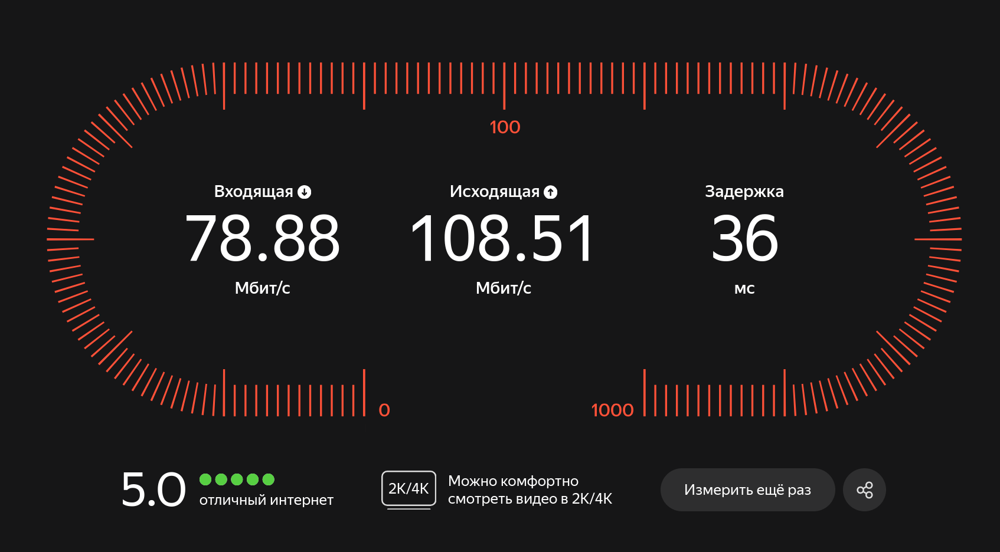
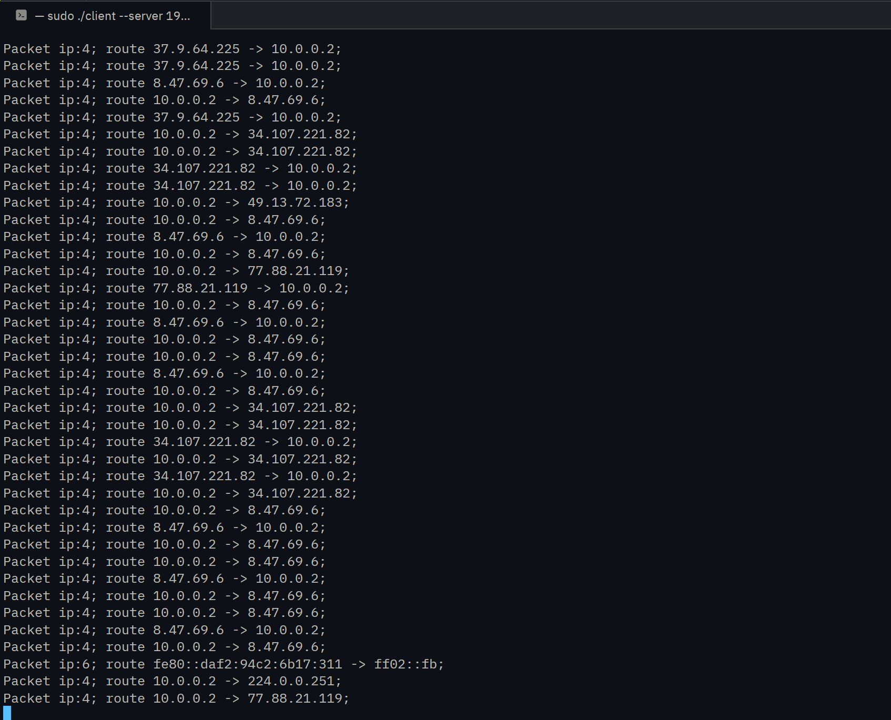

# Что это за проект?

Данный проект был создан для рассмотрения простейшей реализации виртуальных приватных сетей. Проект полностью написан на C++ и собирается CMake.

## Сборка и тесты

Проект собирается через CMake:

```bash
cd build
cmake ..
make
ctest
```

## Описание работы проекта

- сервер создаёт tun1, клиент создаёт tun2
- на сервере настраивается nat через iptables
- клиент передаёт трафик на сервер по TCP без шифрования
- у каждого передаваймого пакета есть 4-байтный заголовок размера пакета.

## Визуализация пути IP пакета


## Доступные параметры сервера

```
--tun-name # default: tun1 -- Имя для нового виртуального интерфейса
--tun-device # default: /dev/net/tun -- Путь к tun
--net # default: 10.0.0.1/24 -- Сеть для нового виртуального интерфейса и IP адрес сервера
--interface # default: wlo1 -- Физический интерфейс устройства
--listen-on # default: 0.0.0.0 -- Адрес, на котором будет слушать сервер
--port # default: 5555 -- Порт, на котором будет слушать сервер
```

```
sudo ./build/server --interface wlo1 --listen-on 0.0.0.0 --port 5555
```

## Доступные параметры клиента

```
--tun-name # default: tun2 -- Имя для нового виртуального интерфейса
--tun-device # default: /dev/net/tun -- Путь к tun
--net # default: 10.0.0.2/24 -- Сеть для нового виртуального интерфейса и IP адрес клиента
--interface # default: wlo1 -- Физический интерфейс устройства
--gateway # default: 10.0.0.1 -- Адрес шлюза для нового виртуального интерфейса (для использования вне локальной сети)
--server # default: 127.0.0.1 -- Адрес сервера
--port # default: 5555 -- Порт, на котором слушает сервер
```
```
./build/client --server <IP_СЕРВЕРА> --interface wlo1 --port 5555
```

## Замеры скорости и примеры работы



## Важные замечания
- Проект не удаляет правила iptables, поэтому их рекомендуется удалять вручную или перезагружать систему после использования.

## Дополнительная информация
Проект был реализован в рамках курса "Алгоритмизация и программирование".
